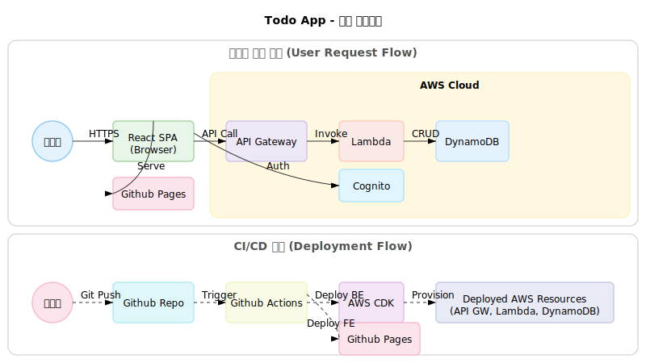
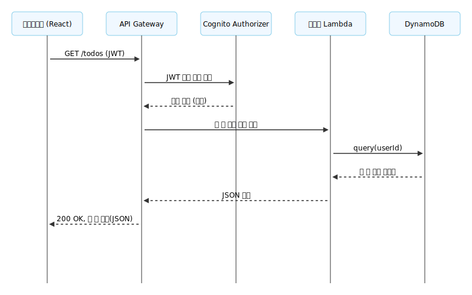
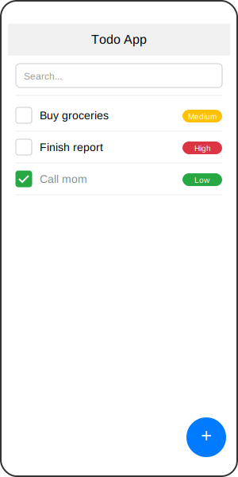
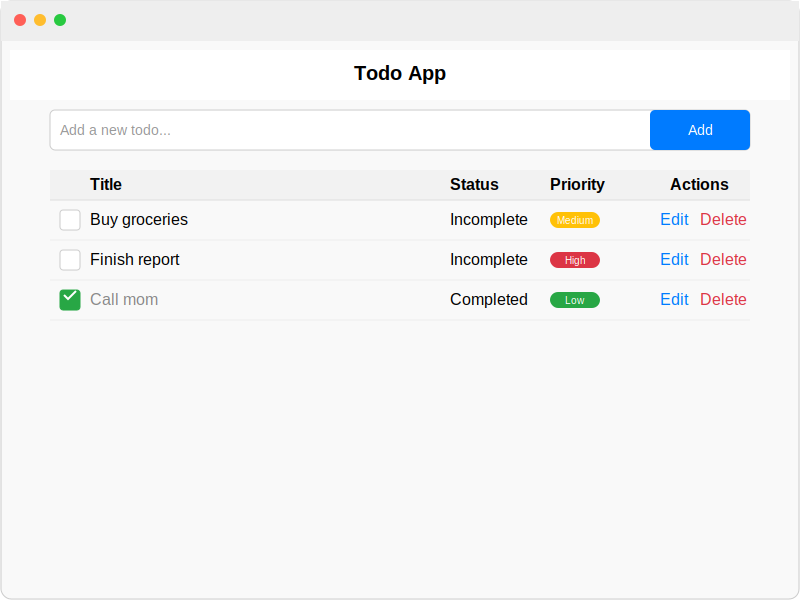

# TODO 웹 앱 설계서

## 1. 시스템 아키텍처

- **프론트엔드**: React + Tailwind CSS, Vite 기반 SPA
- **백엔드**: Node.js (AWS Lambda), API Gateway, DynamoDB
- **인증**: AWS Cognito
- **배포**: 
  - 프론트엔드: Github Pages
  - 백엔드: AWS (CDK 사용)
- **CI/CD**: Github Actions

### 아키텍처 다이어그램  
<p align="center">
  
</p>

## 2. 주요 컴포넌트 설계

### 프론트엔드
- **할 일 목록/추가/수정/삭제 컴포넌트**
- **로그인/회원가입 컴포넌트** (AWS Cognito 연동)
- **상태/우선순위 필터 컴포넌트**
- **검색 바**
- **반응형 레이아웃 및 다크모드 토글**
- **로컬스토리지/서버 데이터 동기화 모듈**

### 백엔드 (Lambda)
- **할 일 CRUD API**
- **인증 미들웨어 (Cognito JWT 검증)**
- **에러/예외 처리**
- **데이터 검증 및 보안 로직**

## 3. 데이터 모델 설계

### 할 일(Todo)  
| 필드명      | 타입      | 설명                |
|-------------|-----------|---------------------|
| id          | string    | UUID                |
| userId      | string    | 사용자 식별자       |
| title       | string    | 할 일 제목          |
| status      | string    | 상태(완료/미완료)   |
| priority    | number    | 우선순위(1~3 등급)  |
| createdAt   | datetime  | 생성일              |
| updatedAt   | datetime  | 수정일              |

### 사용자(User)
- Cognito에서 관리 (userId, email 등)

## 4. API 설계

| 메서드 | 경로         | 설명         | 인증 |
|--------|--------------|--------------|------|
| GET    | /todos       | 할 일 목록 조회 | O   |
| POST   | /todos       | 할 일 추가     | O   |
| PUT    | /todos/{id}  | 할 일 수정     | O   |
| DELETE | /todos/{id}  | 할 일 삭제     | O   |
| POST   | /auth/login  | 로그인        | X   |
| POST   | /auth/signup | 회원가입      | X   |

- 모든 할 일 관련 API는 Cognito 인증 토큰 필요

### 요청 처리 시퀀스 다이어그램 (예: 할 일 목록 조회)

<p align="center">
  
</p>

## 5. UI/UX 설계

- **반응형 레이아웃**: 모바일/PC 모두 지원
- **다크모드/라이트모드 지원**
- **심플하고 직관적인 디자인**
- **상태/우선순위 필터, 정렬, 검색 기능**
- **접근성 고려 (ARIA, 키보드 네비게이션 등)**

### UI 와이어프레임

<p align="center">
  <strong>모바일 뷰</strong><br>
  
</p>
<p align="center">
  <strong>데스크톱 뷰</strong><br>
  
</p>

## 6. 개발 및 배포 전략

- **1차**: 프론트엔드만(React, 로컬스토리지)으로 CRUD 구현 (독립적으로 모든 기능/테스트/UX 완성)
- **2차**: 백엔드(AWS Lambda, DynamoDB) 연동 (서비스 레이어(API 클라이언트)만 교체, UI/상태/테스트는 그대로)
- **3차**: 인증(AWS Cognito) 연동
- **4차**: UI/UX 개선, 반응형, 다크모드
- **5차**: CI/CD, 자동 배포 파이프라인 구축

> ⚡️ **개발 전략:**
> - 프론트엔드 개발을 독립적으로 완료한 후, 서비스 레이어 추상화를 통해 백엔드 연동 시 최소한의 코드 변경으로 전환
> - 프론트 개발 및 테스트, 사용자 피드백을 백엔드와 무관하게 선반영
> - 실제 API 연동 단계에서 기존 UI/상태/테스트를 최대한 재사용

---

## 폴더 구조 예시 (상세)

```
root/
├── apps/
│   ├── frontend/                # 프론트엔드(React+Mantine)
│   │   ├── public/              # 정적 파일 (favicon, index.html 등)
│   │   ├── src/
│   │   │   ├── components/      # UI 컴포넌트
│   │   │   ├── pages/           # 페이지 단위 컴포넌트
│   │   │   ├── hooks/           # 커스텀 훅
│   │   │   ├── services/        # API/비즈니스 로직 (예: todoService.ts, apiClient.ts)
│   │   │   ├── styles/          # 전역 스타일/테마
│   │   │   ├── App.tsx
│   │   │   └── main.tsx
│   │   ├── tests/               # 프론트엔드 단위/통합 테스트
│   │   ├── package.json
│   │   └── ...
│   └── backend/                 # 백엔드(AWS Lambda, CDK 등)
│       ├── cdk/                 # AWS CDK 인프라 코드
│       │   ├── lib/             # 스택 정의 (예: dynamodb-stack.ts, lambda-stack.ts 등)
│       │   ├── bin/             # CDK 엔트리포인트
│       │   └── cdk.json
│       ├── lambdas/             # Lambda 함수 소스
│       │   ├── handlers/        # 각 기능별 핸들러 (예: createTodo.ts, getTodos.ts 등)
│       │   └── tests/           # Lambda 단위 테스트
│       ├── package.json
│       └── ...
├── packages/                    # (선택) 공통 유틸리티, 타입 등 공유 패키지
├── docs/                        # 설계 및 문서
├── node_modules/
├── package.json                 # 개발 환경 및 자동화
- pnpm 기반 workspace
- ESLint, Prettier, 타입스크립트 적용
- Vitest 기반 테스트
- husky pre-commit hook: 실행 코드(src, public, services) 변경 시 lint fix, build, test 자동 실행
└── ...
```

---

이 설계서를 기반으로 각 단계별로 TDD 및 상세 구현을 진행할 수 있습니다. 추가로 상세 설계가 필요한 부분이 있다면 말씀해 주세요.
